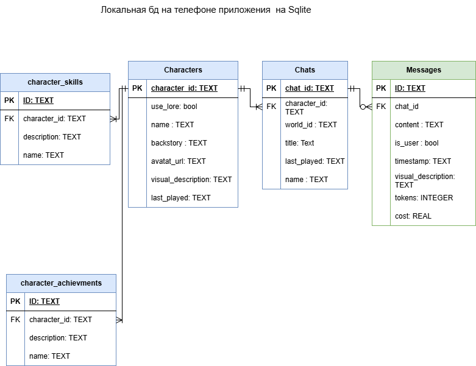

# AI Chat Flutter
cd backend
venv\Scripts\activate
Кроссплатформенное приложение для общения с искусственным интеллектом, разработанное на Flutter. Поддерживает работу с различными AI-моделями через OpenRouter.ai и VseGPT.ru с отслеживанием расходов и детальной аналитикой.



### Чат с ИИ
- Общение с различными языковыми моделями (GPT, Claude, Llama и др.)
- Поиск и выбор моделей с отображением стоимости
- Отслеживание использованных токенов и стоимости каждого сообщения
- Копирование сообщений в буфер обмена
- Сохранение и экспорт истории чата

### Поддержка API провайдеров
- **OpenRouter.ai** - международный провайдер, баланс в долларах ($), расчет за миллион токенов
- **VseGPT.ru** - российский провайдер, баланс в рублях (₽), расчет за тысячу токенов
- Автоматическое определение валюты и форматирование цен

### Аналитика и статистика
- Детальная статистика использования по моделям
- Отслеживание расходов и токенов
- Графики и диаграммы расходов
- Экспорт аналитических данных

### Интерфейс
- Темная тема оформления
- Адаптивный дизайн для разных устройств
- Поддержка русского языка
- Навигация через нижнюю панель

## 🏗️ Архитектура проекта

```
lib/
├── main.dart                    # Точка входа приложения
├── api/
│   └── openrouter_client.dart   # Универсальный клиент для OpenRouter/VseGPT
├── models/
│   └── message.dart             # Модель сообщения чата
├── providers/
│   └── chat_provider.dart       # Управление состоянием чата (Provider)
├── screens/
│   ├── home_screen.dart         # Главный экран
│   ├── chat_screen.dart         # Основной экран чата
│   ├── settings_screen.dart     # Экран настроек API
│   ├── statistics_screen.dart   # Экран статистики использования
│   └── expenses_chart_screen.dart # Экран графиков расходов
├── services/
│   ├── database_service.dart    # Работа с SQLite БД
│   └── analytics_service.dart   # Сервис сбора аналитики
└── widgets/
    ├── navigation_wrapper.dart  # Навигационная обертка с BottomNavigationBar
    ├── auth_error_widget.dart   # Виджет отображения ошибок авторизации
    └── searchable_model_selector.dart # Поиск и выбор AI моделей
```

## 📱 Экраны приложения

### 1. Главная (Home)
- Обзор баланса и последней активности
- Быстрый доступ к основным функциям

### 2. Чат (Chat)
- Интерфейс общения с ИИ
- Выбор модели с поиском и отображением цен
- Отображение стоимости и токенов для каждого сообщения
- Экспорт истории в JSON
- Аналитика использования

### 3. Настройки (Settings)
- Выбор провайдера API (OpenRouter/VseGPT)
- Ввод и проверка API ключа
- Настройка параметров генерации (max_tokens, temperature)
- Тест соединения с API

### 4. Статистика (Statistics)
- Общая статистика использования
- Анализ по моделям и времени
- Детализация расходов

### 5. График расходов (Expenses Chart)
- Визуализация трат по времени
- Сравнение стоимости разных моделей
- Экспорт графиков

## 🔧 Технические детали

### Зависимости
```yaml
dependencies:
  flutter: sdk
  flutter_localizations: sdk
  cupertino_icons: ^1.0.8
  http: ^1.2.1                 # HTTP запросы к API
  provider: ^6.1.2             # Управление состоянием
  shared_preferences: ^2.2.2   # Локальное хранение настроек
  path_provider: ^2.1.2        # Пути к файлам
  sqflite: ^2.3.2             # SQLite база данных
  sqflite_common_ffi: ^2.3.2+1 # SQLite для desktop
  google_fonts: ^6.2.1         # Шрифты Google
  intl: ^0.20.2               # Интернационализация
  path: ^1.9.0                # Работа с путями
  fl_chart: ^0.65.0           # Графики и диаграммы
```

### Поддерживаемые платформы
- ✅ Android (API 21+)
- ✅ Windows (10+)
- ⚠️ iOS (требует настройки)
- ⚠️ Linux (экспериментально)

### Управление состоянием
- **Provider** для управления состоянием чата
- **SharedPreferences** для хранения настроек API
- **SQLite** для локального хранения истории сообщений
- **Singleton** паттерн для API клиента

### Локализация
- Русский язык
- Поддержка UTF-8 для корректного отображения текста
- Форматирование валют в зависимости от провайдера

## ⚙️ Конфигурация

### Настройки приложения (app_setting.json)
Файл содержит настройки по умолчанию:
```json
{
  "theme": "dark",
  "default_model": "gpt-3.5-turbo",
  "max_tokens": 1000,
  "temperature": 0.7,
  "save_history": true,
  "auto_update": false,
  "backup_enabled": true,
  "backup_interval": 24,
  "metrics_collection": true,
  "language": "en",
  "ui": {
    "font_size": 16,
    "animations_enabled": true,
    "compact_mode": false
  },
  "advanced": {
    "debug_mode": false,
    "log_level": "INFO",
    "cache_size": 100,
    "timeout": 30
  }
}
```

### Настройки API (SharedPreferences)
Настройки хранятся локально и настраиваются через экран Settings:
- `provider` - выбор провайдера ('openrouter' или 'vsegpt')
- `api_key` - API ключ для авторизации
- `max_tokens` - максимальное количество токенов (по умолчанию 1000)
- `temperature` - температура генерации (по умолчанию 0.7)

### Получение API ключей
- **OpenRouter.ai**: Регистрация на [openrouter.ai](https://openrouter.ai)
- **VseGPT.ru**: Регистрация на [vsegpt.ru](https://vsegpt.ru)

## 🚀 Быстрый старт

1. **Клонирование репозитория**
   ```bash
   git clone https://github.com/D4us-M4chanicus/AI_CHAT_Flutter.git
   cd AI_CHAT_Flutter
   ```

2. **Установка зависимостей**
   ```bash
   flutter pub get
   ```

3. **Запуск приложения**
   ```bash
   # Android
   flutter run
   
   # Windows
   flutter run -d windows
   ```

4. **Настройка API**
   - Откройте приложение
   - Перейдите в раздел "Настройки"
   - Выберите провайдера (OpenRouter или VseGPT)
   - Введите API ключ
   - Нажмите "Тест соединения" для проверки
   - Сохраните настройки

## 📖 Подробная установка

Детальные инструкции по установке и настройке среды разработки см. в [INSTALL.md](INSTALL.md).

## 🔒 Безопасность и приватность

- API ключи хранятся локально в SharedPreferences
- Вся история чата сохраняется только на устройстве пользователя
- Нет передачи данных третьим лицам
- Возможность экспорта и полной очистки данных
- Логирование для отладки (только в debug режиме)

## 📊 Функции аналитики

### Отслеживание использования
- Количество сообщений по моделям
- Расход токенов и стоимость
- Время ответа API
- Статистика сессий

### Экспорт данных
- История чата в JSON формате
- Логи приложения в текстовом формате
- Аналитические данные
- Графики расходов

## 🛠️ Разработка

### Архитектурные решения
- **Singleton** для API клиента
- **Provider** для управления состоянием
- **Repository** паттерн для работы с данными
- **Error Boundary** для обработки ошибок UI

### Обработка ошибок
- Graceful degradation при недоступности API
- Fallback модели при ошибках загрузки
- Детальное логирование для отладки
- Пользовательские уведомления об ошибках

## 📄 Лицензия

Этот проект распространяется под лицензией Apache v2.0. См. файл [LICENSE](LICENSE) для подробностей.

## 🔄 Версии

**Текущая версия: 1.0.0+1**

### Планы развития
- [ ] Поддержка дополнительных AI провайдеров
- [ ] Голосовые сообщения
- [ ] Темы оформления
- [ ] Синхронизация между устройствами
- [ ] Плагины и расширения
- [ ] Улучшенная аналитика
